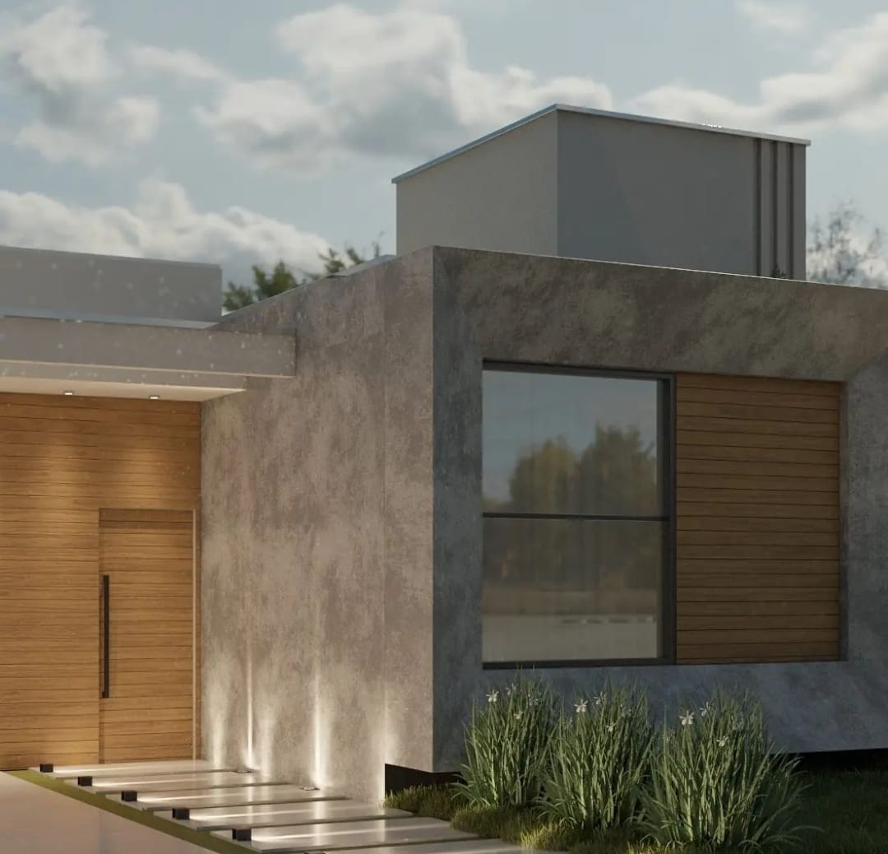
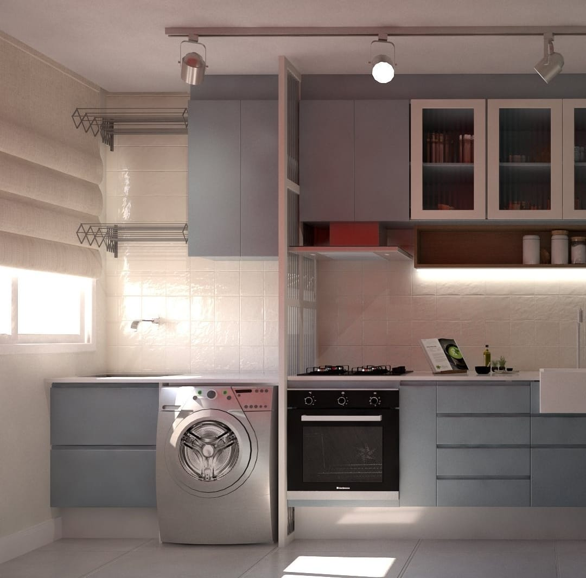
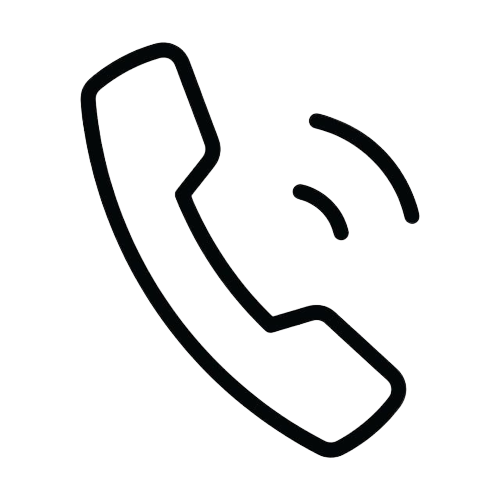

<!DOCTYPE html>
<html lang="pt-br">
<head>
    <link rel="preconnect" href="https://fonts.googleapis.com">
    <link rel="preconnect" href="https://fonts.gstatic.com" crossorigin>
    <link href="https://fonts.googleapis.com/css2?family=Roboto:wght@300&display=swap" rel="stylesheet">

    <meta name = "description" content = "South Construtora, construimos e reformamos">
    <meta name = "robôs" content = "index, nofollow">
    <meta name="author" content="Engenheira Jenifer">
    <meta name="keywords" content="construção, construção civil, reforma, maringá, sarandi, projetos de casa">
    <meta>

    <meta charset="UTF-8">
    <meta http-equiv="X-UA-Compatible" content="IE=edge">
    <meta name="viewport" content="width=device-width, initial-scale=1.0">

    <link rel="stylesheet" href="./css/style.css">
    <link rel="shortcut icon" href="" type="image/x-icon">
    <title>Projetos e Construção</title>
</head>
<body>

    <section id="menu-inicial">
        

            

                <h2>ENGENHARIA</h2>
             

           

            <nav>
                <ul>
                    <a class="selecionado" href="">PROJETOS</a>
                    <a href="">CONSTRUIR</a>
                    <a href="">REFORMAR</a>
                </ul>
            </nav>
           

        

    </section>

    

    <section class="slider-primeira-sessao">
        

            
            
        

    </section>

    <section>
        

            
        

    </section>

  
    
</body>
</html>